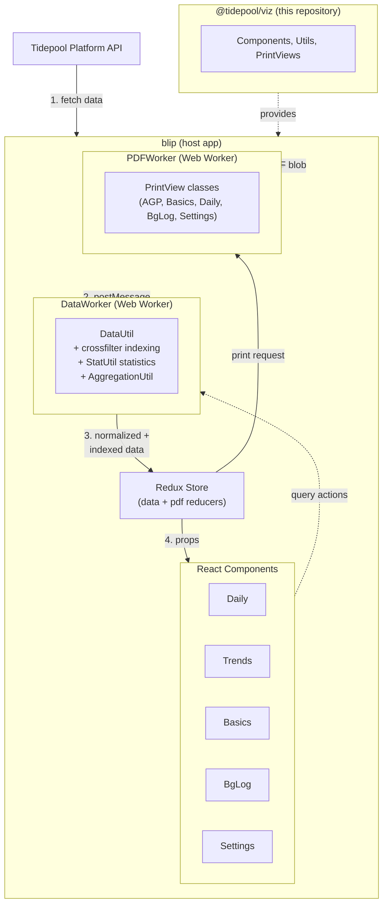

# Architecture

This document explains the architectural decisions behind @tidepool/viz.

## System Overview

### Data Flow

1. **blip** fetches patient data from the Tidepool Platform API
2. **DataWorker** receives raw data via postMessage
3. **DataUtil** normalizes, validates, and indexes data using crossfilter
4. **Components** dispatch query actions; DataWorker responds with filtered data
5. **StatUtil** computes statistics on demand during queries
6. **PDFWorker** generates PDF reports using PrintView classes

---

## Design Principles

The visualization code is designed as *one* unified interface with multiple surface manifestations (daily, bgLog, trends, basics, device settings) rather than separate applications. This means shared state across views:
- Blood glucose display units (mg/dL or mmol/L)
- Target blood glucose range
- Display timezone preference
- Preprocessed diabetes device data
- Current date focus and day-of-week filters
- Toggle states and UI preferences

[Redux](http://redux.js.org/) stores this shared state in blip. The viz library provides components that receive data via props, making it framework-agnostic at the component level.

---

## Data Processing

Data processing runs in a [Web Worker](https://developer.mozilla.org/en-US/docs/Web/API/Web_Workers_API/Using_web_workers) to avoid blocking the UI. `DataUtil` in blip's `DataWorker` handles:

1. Schema validation via `SchemaValidator`
2. Timestamp normalization to UTC milliseconds
3. Datum joining (wizard↔bolus, bolus↔dosingDecision)
4. Metadata computation (BG sources, latest pump, devices)
5. Crossfilter indexing for efficient queries

See JSDoc in `src/utils/DataUtil.js` for details.

### Data Filtering

[Crossfilter](http://square.github.io/crossfilter/) enables efficient filtering of large datasets. DataUtil creates dimensions for:

- `byTime` - Primary time-based filtering
- `byType` - Filter by data type (cbg, bolus, basal, etc.)
- `bySubType` - Filter by subtype (e.g., deviceEvent subtypes)
- `byDayOfWeek` - Day-of-week filtering for trends
- `byDate` - Local date for aggregations
- `bySampleInterval` - CGM sample interval filtering

The `query()` method accepts an endpoints array and returns filtered data efficiently.

### Statistics

`StatUtil` computes statistics during queries. Available statistics:

| Statistic | Description |
|-----------|-------------|
| `timeInRange` | CGM time distribution across glucose ranges |
| `readingsInRange` | SMBG count distribution across ranges |
| `averageGlucose` | Mean blood glucose |
| `standardDev` | Standard deviation of BG |
| `coefficientOfVariation` | CV% (SD/mean × 100) |
| `glucoseManagementIndicator` | GMI/eA1C from CGM |
| `sensorUsage` | CGM wear time percentage |
| `totalInsulin` | Basal + bolus breakdown |
| `carbs` | Daily carbohydrate intake |
| `timeInAuto` | Time in automated basal mode |
| `timeInOverride` | Time in override modes |

See JSDoc in `src/utils/StatUtil.js` for calculation details.

---

## Component Architecture

Components follow React best practices:

- Container components for lifecycle and state management
- Pure functional components for rendering
- CSS modules for styling
- Separate animation layer (react-motion)
- Reusable low-level renderers across views

---

## PDF Generation

PDF reports are generated in a separate Web Worker (`PDFWorker` in blip) using `pdfkit`.

### PrintView Classes

| Class | Report Type |
|-------|-------------|
| `AGPPrintView` | Ambulatory Glucose Profile (CGM summary) |
| `BasicsPrintView` | Basics view (calendar summaries) |
| `DailyPrintView` | Daily view (24-hour timeline) |
| `BgLogPrintView` | BG Log (tabular SMBG data) |
| `SettingsPrintView` | Device settings |

### AGP Report Flow

AGP reports require special handling because Plotly charts must be rendered on the main thread:

1. PDFWorker requests AGP image generation
2. Main thread renders Plotly charts to images
3. Images are sent back to PDFWorker
4. PDFWorker composites final PDF
