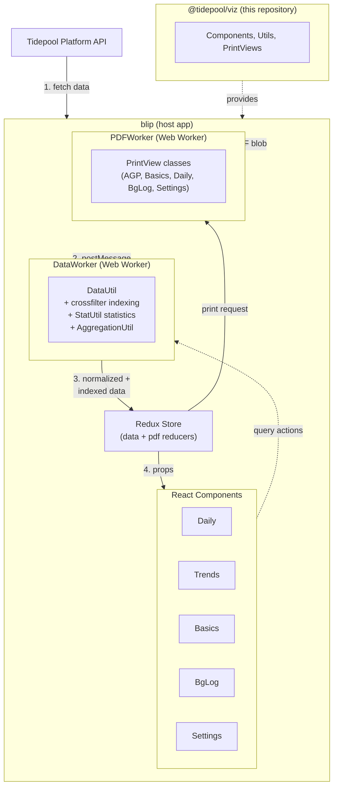
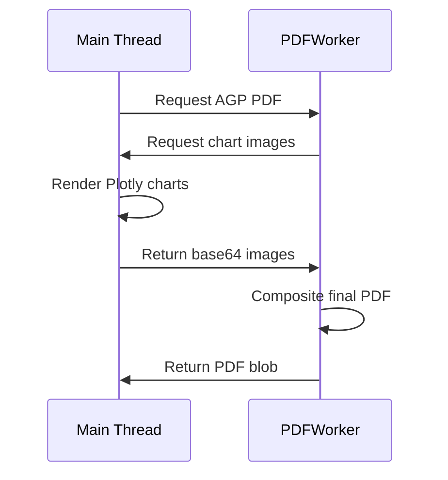

# Architecture

This document explains the architectural decisions behind `@tidepool/viz`.

> **Related**: See the [Tidepool Data Model](./tidepool-data-model.md) for data type reference and [Diabetes Primer](./diabetes-primer.md) for medical terminology.

---

## System Overview



### Data Flow

1. **blip** fetches patient data from the Tidepool Platform API
2. **DataWorker** receives raw data via postMessage
3. **DataUtil** normalizes, validates, and indexes data using crossfilter
4. **Components** dispatch query actions; DataWorker responds with filtered data
5. **StatUtil** computes statistics on demand during queries
6. **PDFWorker** generates PDF reports using PrintView classes

---

## Design Principles

The visualization code is designed as *one* unified interface with multiple surface manifestations (daily, bgLog, trends, basics, device settings) rather than separate applications. This means shared state across views:

- Blood glucose display units (mg/dL or mmol/L)
- Target blood glucose range
- Display timezone preference
- Preprocessed diabetes device data
- Current date focus and day-of-week filters
- Toggle states and UI preferences

[Redux](http://redux.js.org/) stores this shared state in blip. The viz library provides components that receive data via props, making it framework-agnostic at the component level.

---

## Data Processing

Data processing runs in a [Web Worker](https://developer.mozilla.org/en-US/docs/Web/API/Web_Workers_API/Using_web_workers) to avoid blocking the UI. `DataUtil` handles:

1. Schema validation via `SchemaValidator`
2. Timestamp normalization to UTC milliseconds
3. Datum joining (wizard↔bolus, bolus↔dosingDecision)
4. Metadata computation (BG sources, latest pump, devices)
5. Crossfilter indexing for efficient queries

### DataUtil Core Methods

| Method | Purpose |
|--------|---------|
| `addData(rawData, patientId)` | Primary ingestion - validates, normalizes, indexes |
| `query(query)` | Primary query - returns filtered data + stats |
| `setEndpoints(start, end)` | Sets time range for queries |
| `setBgPrefs(prefs)` | Sets BG units and target ranges |
| `setTimePrefs(prefs)` | Sets timezone preferences |

### Data Filtering

[Crossfilter](http://square.github.io/crossfilter/) enables efficient filtering of large datasets. DataUtil creates dimensions for:

| Dimension | Purpose |
|-----------|---------|
| `byTime` | Primary time-based filtering |
| `byType` | Filter by data type (cbg, bolus, basal, etc.) |
| `bySubType` | Filter by subtype (e.g., deviceEvent subtypes) |
| `byDayOfWeek` | Day-of-week filtering for trends |
| `byDate` | Local date for aggregations |
| `bySampleInterval` | CGM sample interval filtering |

The `query()` method accepts an endpoints array and returns filtered data efficiently.

---

## Statistics

`StatUtil` computes statistics during queries. All glucose statistics support both mg/dL and mmol/L units.

### Available Statistics

| Statistic | Method | Description |
|-----------|--------|-------------|
| `averageGlucose` | `getAverageGlucoseData()` | Arithmetic mean of BG values |
| `standardDev` | `getStandardDevData()` | Sample standard deviation (requires ≥30 readings) |
| `coefficientOfVariation` | `getCoefficientOfVariationData()` | CV% = (SD / mean) × 100 |
| `glucoseManagementIndicator` | `getGlucoseManagementIndicatorData()` | GMI (requires CGM, 14+ days, 70%+ usage) |
| `timeInRange` | `getTimeInRangeData()` | CGM time distribution across glucose ranges |
| `readingsInRange` | `getReadingsInRangeData()` | SMBG count distribution across ranges |
| `sensorUsage` | `getSensorUsage()` | CGM wear time percentage |
| `totalInsulin` | `getInsulinData()` | Basal + bolus breakdown |
| `carbs` | `getCarbsData()` | Daily carbohydrate intake |
| `timeInAuto` | `getTimeInAutoData()` | Time in automated basal mode |
| `timeInOverride` | `getTimeInOverrideData()` | Time in override modes |
| `bgExtents` | `getBgExtentsData()` | Min/max BG, date range |

### Stat Calculation Details

For mathematical formulas and implementation details, see:

- [Glucose Statistics](../domains/glucose/statistics.md) - BG-specific calculations with LaTeX formulas

### Stat Constants

Statistics are defined in `src/utils/stat.js`:

```javascript
export const commonStats = {
  averageGlucose: 'averageGlucose',
  coefficientOfVariation: 'coefficientOfVariation',
  glucoseManagementIndicator: 'glucoseManagementIndicator',
  readingsInRange: 'readingsInRange',
  sensorUsage: 'sensorUsage',
  standardDev: 'standardDev',
  timeInAuto: 'timeInAuto',
  timeInOverride: 'timeInOverride',
  timeInRange: 'timeInRange',
  totalInsulin: 'totalInsulin',
  // ...
};
```

---

## Component Architecture

Components follow React best practices:

```
┌─────────────────────────────────────────────────────────────┐
│  Container Component (state, lifecycle)                      │
│  ├─ Connected to Redux                                       │
│  └─ Dispatches query actions                                 │
│     ┌──────────────────────────────────────────────────────┐ │
│     │  View Component (pure functional)                     │ │
│     │  ├─ Receives data via props                          │ │
│     │  ├─ Renders SVG or DOM elements                      │ │
│     │  └─ Uses CSS modules for styling                     │ │
│     │     ┌───────────────────────────────────────────────┐│ │
│     │     │  Low-level Renderers (reusable)               ││ │
│     │     │  ├─ BGSlice, BolusTooltip, BasalChart         ││ │
│     │     │  └─ Shared across Daily, Trends, Basics       ││ │
│     │     └───────────────────────────────────────────────┘│ │
│     └──────────────────────────────────────────────────────┘ │
└─────────────────────────────────────────────────────────────┘
```

**Key patterns:**

- **Container components** for lifecycle and state management
- **Pure functional components** for rendering
- **CSS modules** for scoped styling
- **react-motion** for animations
- **Reusable renderers** shared across views

### View Components

| View | Component | Description |
|------|-----------|-------------|
| Daily | `src/components/daily/` | 24-hour timeline with all data types |
| Trends | `src/components/trends/` | Multi-day overlay and statistics |
| Basics | (in blip) | Calendar summary view |
| BG Log | (in blip) | Tabular blood glucose data |
| Settings | `src/components/settings/` | Pump configuration display |

---

## PDF Generation

PDF reports are generated in a separate Web Worker (`PDFWorker` in blip) using [pdfkit](https://pdfkit.org/).

### PrintView Classes

| Class | Report | Location |
|-------|--------|----------|
| `AGPPrintView` | Ambulatory Glucose Profile (CGM summary) | `src/modules/print/AGPPrintView.js` |
| `BasicsPrintView` | Basics view (calendar summaries) | `src/modules/print/BasicsPrintView.js` |
| `DailyPrintView` | Daily view (24-hour timeline) | `src/modules/print/DailyPrintView.js` |
| `BgLogPrintView` | BG Log (tabular SMBG data) | `src/modules/print/BgLogPrintView.js` |
| `SettingsPrintView` | Device settings | `src/modules/print/SettingsPrintView.js` |

### AGP Report Flow

AGP reports require special handling because [Plotly](https://plotly.com/javascript/) charts must be rendered on the main thread:



1. PDFWorker requests AGP image generation
2. Main thread renders Plotly charts to images
3. Images are sent back to PDFWorker
4. PDFWorker composites final PDF

---

## Key Source Files

| Category | File | Purpose |
|----------|------|---------|
| Data | `src/utils/DataUtil.js` | Core data management (~2900 lines) |
| Stats | `src/utils/StatUtil.js` | Statistical calculations (~755 lines) |
| Stats | `src/utils/stat.js` | Stat definitions and formatting |
| Validation | `src/utils/validation/schema.js` | Data type schemas |
| Constants | `src/utils/constants.js` | App-wide constants |
| Print | `src/modules/print/` | PDF generation classes |
| Components | `src/components/` | React visualization components |

---

## See Also

- [Getting Started](../GettingStarted.md) - Development setup
- [Tidepool Data Model](./tidepool-data-model.md) - Data type reference
- [Dependencies](../deps/README.md) - Third-party libraries (D3, React, etc.)
