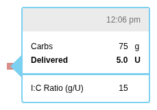
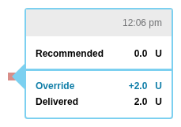

# Bolus Rendering

This document covers the visual representation of bolus data, including shapes, colors, tooltips, and screenshots.

---

## Visual Components

Boluses are rendered as vertical bars with various indicators:

```
         ▲ Override triangle (pointing up)
         │
    ─────┼───── Recommended line (when wizard present)
         │
    ┌────┴────┐
    │█████████│ Delivered bar (solid fill)
    │█████████│
    │░░░░░░░░░│ Undelivered portion (hatched, if interrupted)
    └─────────┘
         │
         ▼ Underride triangle (pointing down)
```

### Bar Colors

| Type | Color | Variable |
|------|-------|----------|
| Normal bolus | Purple | `--bolus` |
| Extended bolus | Lighter purple | `--extendedBolus` |
| Automated bolus | Automated blue | `--automated` |
| Undelivered | Striped/hatched | Pattern fill |

---

## Normal Bolus Variations

### Simple Normal Bolus

Just a solid bar representing delivered units.


### Interrupted Normal Bolus

Shows delivered (solid) and undelivered (hatched) portions.


### Override on Normal Bolus

Triangle pointing UP at recommended line.


### Underride on Normal Bolus

Triangle pointing DOWN at recommended line.


### Zero Override

Delivered > 0 when recommended = 0.


### Override + Interrupted

Both override indicator and hatched undelivered portion.


### Underride + Interrupted

Both underride indicator and hatched undelivered portion.


---

## Extended (Square) Bolus Variations

Extended boluses show duration with a horizontal bar.

### Simple Extended Bolus


### Interrupted Extended Bolus


### Override on Extended


### Underride on Extended


---

## Combo (Dual Wave) Bolus Variations

Combo boluses combine immediate and extended portions.

### Simple Combo Bolus


### Interrupted During Normal Portion


### Interrupted During Extended Portion


### Override on Combo


### Override + Interrupted Combo


### Underride on Combo


---

## Bolus Tooltips

Tooltips show detailed bolus information on hover.

### Component

**File**: `src/components/daily/bolustooltip/BolusTooltip.js`

### Normal Bolus Tooltip


### With Carb Input



### With BG Input


### With BG and Carb Input


### Override Tooltip

Shows recommended vs delivered.



### Underride Tooltip


### Cancelled Bolus Tooltip


### Automated Bolus Tooltip


### Extended Bolus Tooltip


### Combo Bolus Tooltip


---

## Pump-Specific Target Display

Different pumps display BG targets differently in tooltips.

### Medtronic Target

Shows low-high range.


### Tandem Target

Shows single target value.


### Insulet (OmniPod) Target

Shows target with "correct above" threshold.


### Animas Target

Shows target ± range.


### Loop Auto Target

Shows low-high range for automated systems.


---

## Manual Insulin (Pen) Tooltips

### Standard Insulin


### By Acting Type

| Type | Screenshot |
|------|------------|
| Rapid |  |
| Short |  |
| Intermediate |  |
| Long |  |

---

## Loop Dosing Decision

Shows Loop algorithm recommendation.


---

## Carb Exchange Display

Some pumps use carb exchanges instead of grams.

### With Exchange Input


### Zero Exchange


---

## Precision Display

Bolus values display varying precision.

### Standard Precision


### High Precision


### Very High Precision


---

## Key Source Files

| Purpose | File |
|---------|------|
| Bolus rendering | `src/components/daily/` |
| Bolus tooltip | `src/components/daily/bolustooltip/BolusTooltip.js` |
| Bolus fixtures | `data/bolus/fixtures.js` |
| Stories | `stories/components/daily/` |

---

## See Also

- [Bolus Overview](./index.md)
- [Bolus Calculations](./calculations.md)
- [Device-Specific Notes](./device-notes.md)
