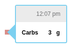

# Carbs Rendering

This document covers the visualization of carbohydrate data, including tooltips and visual indicators.

---

## Food Tooltip

The `FoodTooltip` component displays details for standalone food/carb entries.

### Component

**File**: `src/components/daily/foodtooltip/FoodTooltip.js`

### Props

| Prop | Type | Description |
|------|------|-------------|
| `food` | object | Food datum with nutrition data |
| `timePrefs` | object | Timezone preferences |
| `position` | object | `{ top, left }` position |
| `side` | string | Tooltip placement |

### Content

- **Title**: Time of entry ("h:mm a")
- **Carbs**: Net carbohydrates in grams
- **Absorption**: Estimated absorption duration (Loop systems)
- **Source**: Entry source indicator

---

## Screenshots by Source

### Standard Food Entry



Basic food entry with carb amount.

### Dexcom Food Entry


Food entry from Dexcom app integration.

### Loop Food Entry


Food entry from Loop/Tidepool Loop with absorption duration.

### Loop with Time of Entry


Shows when Loop records a different "time of entry" vs actual entry time.

### Loop Edited Entry


Food entry that was edited after initial entry.

---

## Carbs on Bolus Tooltips

When carbs are entered via the bolus wizard, they appear in the bolus tooltip:

### Content

- **Carb Input**: Grams or exchanges entered
- **I:C Ratio**: Insulin-to-carb ratio used
- **Carb Recommendation**: Insulin recommended for carbs

See [Bolus Rendering](../insulin/bolus/rendering.md) for bolus tooltip details.

---

## Carb Circle Visualization

In the Daily view, boluses with carbs show a carb circle indicator:

### Component

**File**: `src/components/common/data/Bolus.js`

### Visual

- **Shape**: Circle above bolus triangle
- **Size**: Proportional to carb amount
- **Color**: Orange/yellow
- **Position**: Centered above bolus

---

## Carb Exchange Display

For Medtronic pumps using carb exchanges:

### Conversion

```javascript
// 1 exchange = 15 grams
getDeconvertedCarbExchange(carbInGrams) {
  return carbInGrams / 15;
}
```

### Display

When exchange units are detected, values display as:
- "3 exchanges" instead of "45 g"

---

## Average Daily Carbs Stat

The carbs statistic shows average daily carb intake.

### Screenshot


See [Carbs Statistics](./statistics.md) for calculation details.

---

## Key Source Files

| Purpose | File |
|---------|------|
| Food Tooltip | `src/components/daily/foodtooltip/FoodTooltip.js` |
| Bolus with carbs | `src/components/common/data/Bolus.js` |
| Carb utilities | `src/utils/bolus.js` |
| Exchange conversion | `src/utils/DataUtil.js` |

---

## See Also

- [Carbs Domain](./index.md) - Data structures and sources
- [Carbs Statistics](./statistics.md) - Avg Daily Carbs calculation
- [Bolus Rendering](../insulin/bolus/rendering.md) - Carbs in bolus tooltips
