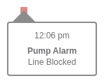

# Alarms

Part of the [Device Events Domain](./index.md).

Device alarms indicate critical events requiring attention.

---

## Alarm Event Structure

```javascript
{
  type: "deviceEvent",
  subType: "alarm",
  alarmType: "occlusion",         // see types below
  source: "twiist",               // device source
  time: "2024-01-15T14:30:00Z",
}
```

---

## Recognized Alarm Types

| Alarm Type | Constant | Description |
|------------|----------|-------------|
| `no_delivery` | `ALARM_NO_DELIVERY` | Insulin delivery stopped |
| `auto_off` | `ALARM_AUTO_OFF` | Pump auto-off triggered |
| `no_insulin` | `ALARM_NO_INSULIN` | Reservoir/cassette empty |
| `no_power` | `ALARM_NO_POWER` | Battery depleted |
| `occlusion` | `ALARM_OCCLUSION` | Infusion line blocked |
| `over_limit` | `ALARM_OVER_LIMIT` | Delivery limit exceeded |

---

## Alarm Tooltips

### Auto Off


Triggered when pump hasn't received user input for an extended period.

### No Delivery


Insulin delivery has stopped unexpectedly.

### No Insulin


Reservoir or cassette is empty.

### No Power


Battery is depleted.

### Occlusion



Infusion line is blocked - requires site change.

### Over Limit


Delivery limit has been exceeded.

---

## Device-Specific Alarm Labels

Alarm labels vary by manufacturer. The `getPumpVocabulary()` function returns device-specific terminology:

| Alarm | Twiist | Medtronic | Generic |
|-------|--------|-----------|---------|
| `no_insulin` | Cassette Empty | Reservoir Empty | No Insulin |
| `occlusion` | Line Blocked | Occlusion Detected | Occlusion |
| `no_delivery` | - | Insulin Delivery Stopped | No Delivery |
| `auto_off` | Auto Off | Auto Off | Auto Off |

---

## Alarm Processing

Alarms are tagged during data processing for efficient filtering:

```javascript
// src/utils/DataUtil.js
d.tags = {
  [ALARM]: d.subType === 'alarm' && _.includes(recognizedAlarmTypes, d.alarmType),
  [ALARM_NO_INSULIN]: d.alarmType === ALARM_NO_INSULIN,
  [ALARM_OCCLUSION]: d.alarmType === ALARM_OCCLUSION,
};
```

---

## Key Source Files

| Purpose | File |
|---------|------|
| Alarm tooltip | `src/components/daily/alarmtooltip/AlarmTooltip.js` |
| Constants | `src/utils/constants.js` |
| Pump vocabulary | `src/utils/device.js` |
| Data processing | `src/utils/DataUtil.js` |

---

## See Also

- [Device Events Overview](./index.md)
- [Suspends](./suspends.md) - Related delivery interruption
