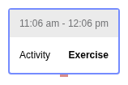

# Device Events Domain

Device events capture various state changes and actions from insulin pumps, CGMs, and other diabetes devices. This domain covers suspends, primes, alarms, calibrations, and settings overrides.

---

## Overview

The `deviceEvent` type is a versatile container for device-specific events. Each event has a `subType` identifying the specific event category.

| SubType | Description | Primary Use |
|---------|-------------|-------------|
| `status` | Pump status changes (suspend/resume) | Tracking delivery gaps |
| `prime` | Tubing/cannula priming | Site change indicators |
| `reservoirChange` | Cartridge/reservoir replaced | Site change indicators |
| `alarm` | Device alarms | Critical event tracking |
| `calibration` | CGM calibration | Data quality context |
| `timeChange` | Device clock adjustment | Timezone detection |
| `pumpSettingsOverride` | Activity modes (sleep, exercise) | Behavior tracking |

---

## Data Structure

### Base Device Event

```javascript
{
  type: "deviceEvent",
  subType: "status",              // event category
  time: "2024-01-15T14:30:00Z",
  normalTime: 1705329000000,      // processed timestamp
  // ... common fields
}
```

---

## Suspend Events

Suspends track when insulin delivery is paused.

### Status Event (Suspend/Resume)

```javascript
{
  type: "deviceEvent",
  subType: "status",
  status: "suspended",            // or "resumed"
  duration: 300000,               // 5 minutes (ms)
  reason: {
    suspended: "manual",          // or "automatic", "low_glucose"
  },
}
```

### Suspend Reasons

| Reason | Description |
|--------|-------------|
| `manual` | User-initiated suspend |
| `automatic` | Algorithm-initiated (predictive low) |
| `low_glucose` | Low glucose suspend (LGS) |

### Rendering

Suspends are shown as icons/markers on the daily view timeline.


### Counting Distinct Suspends

Consecutive suspend records (same `normalEnd` to `normalTime`) are counted as one distinct suspend event:

```javascript
// src/utils/basal.js
export const countDistinctSuspends = (data) => {
  const suspends = _.filter(data.data, d => d.deliveryType === 'suspend');
  
  const result = { prev: {}, distinct: 0 };
  _.reduce(suspends, (acc, datum) => {
    // Only count non-contiguous suspends as distinct
    if (_.get(acc.prev, 'normalEnd') === datum.normalTime) {
      // Skip - contiguous with previous
    } else {
      acc.distinct++;
    }
    acc.prev = datum;
    return acc;
  }, result);
  
  return result.distinct;
};
```

---

## Site Change Events

Site changes are inferred from prime and reservoir change events. Different manufacturers use different terminology.

### Prime Events

```javascript
{
  type: "deviceEvent",
  subType: "prime",
  primeTarget: "tubing",          // or "cannula"
  volume: 15.0,                   // units primed
}
```

### Reservoir Change

```javascript
{
  type: "deviceEvent",
  subType: "reservoirChange",
}
```

### Manufacturer Terminology

| Action | Tandem | Insulet (OmniPod) | Medtronic | Animas |
|--------|--------|-------------------|-----------|--------|
| **Reservoir** | Cartridge Change | Pod Change | Rewind | Go Rewind |
| **Tubing** | Tubing Fill | Pod Activate | Prime | Go Prime |
| **Cannula** | Cannula Fill | Prime | Cannula Prime | Cannula Fill |

### Site Change Images

The visualization uses device-specific icons:

| Image | Description |
|-------|-------------|
| `sitechange-reservoir.png` | Reservoir/cartridge change |
| `sitechange-tubing.png` | Tubing prime |
| `sitechange-cannula.png` | Cannula prime |
| `sitechange-loop-tubing.png` | Loop-specific tubing |
| `sitechange-twiist-cassette.png` | Twiist cassette change |

---

## Alarms

Device alarms indicate critical events requiring attention.

### Alarm Event Structure

```javascript
{
  type: "deviceEvent",
  subType: "alarm",
  alarmType: "occlusion",         // see types below
  source: "twiist",               // device source
}
```

### Recognized Alarm Types

| Alarm Type | Constant | Description |
|------------|----------|-------------|
| `no_delivery` | `ALARM_NO_DELIVERY` | Insulin delivery stopped |
| `auto_off` | `ALARM_AUTO_OFF` | Pump auto-off triggered |
| `no_insulin` | `ALARM_NO_INSULIN` | Reservoir/cassette empty |
| `no_power` | `ALARM_NO_POWER` | Battery depleted |
| `occlusion` | `ALARM_OCCLUSION` | Infusion line blocked |
| `over_limit` | `ALARM_OVER_LIMIT` | Delivery limit exceeded |

### Alarm Tooltips


### Device-Specific Alarm Labels

Alarm labels vary by manufacturer (from `getPumpVocabulary()`):

| Alarm | Twiist | Medtronic |
|-------|--------|-----------|
| `no_insulin` | Cassette Empty | Reservoir Empty |
| `occlusion` | Line Blocked | Occlusion Detected |
| `no_delivery` | - | Insulin Delivery Stopped |

---

## Pump Settings Override

Settings overrides are temporary modes that adjust insulin delivery parameters.

### Override Event Structure

```javascript
{
  type: "deviceEvent",
  subType: "pumpSettingsOverride",
  overrideType: "sleep",          // see types below
  duration: 28800000,             // 8 hours (ms)
  bgTarget: {
    low: 100,
    high: 120,
  },
}
```

### Override Types

| Type | Constant | Description | Common Use |
|------|----------|-------------|------------|
| `sleep` | `SLEEP` | Overnight mode | Tighter targets during sleep |
| `physicalActivity` | `PHYSICAL_ACTIVITY` | Exercise mode | Relaxed targets during activity |
| `preprandial` | `PREPRANDIAL` | Pre-meal mode | Tighter targets before eating |

### Manufacturer-Specific Modes

| Manufacturer | Available Modes |
|--------------|-----------------|
| **Tandem** | Sleep, Exercise (Physical Activity) |
| **Tidepool Loop** | Workout, Pre-Meal |
| **DIY Loop** | Workout |
| **Twiist** | Sleep, Exercise, Pre-Meal |

### Override Tooltips





### Time in Override Statistics

`StatUtil.getTimeInOverrideData()` calculates duration by override type:

```javascript
// Returns:
{
  durations: {
    sleep: 28800000,              // 8 hours in sleep mode
    physicalActivity: 3600000,   // 1 hour in exercise
  },
  total: 32400000,               // total override time
}
```

---

## Calibration Events

CGM calibration using fingerstick readings:

```javascript
{
  type: "deviceEvent",
  subType: "calibration",
  value: 105,                     // fingerstick value
  units: "mg/dL",
}
```

Calibrations are less common with newer CGM systems (Dexcom G6/G7, Libre) that are factory-calibrated.

---

## Time Change Events

Device clock adjustments, used for timezone detection:

```javascript
{
  type: "deviceEvent",
  subType: "timeChange",
  change: {
    from: "2024-01-15T14:30:00",
    to: "2024-01-15T15:30:00",
    agent: "manual",              // or "automatic"
  },
}
```

Time changes help `DataUtil` recommend appropriate timezone settings for data display.

---

## Processing & Tagging

Device events are tagged during data processing for efficient filtering:

```javascript
// src/utils/DataUtil.js
if (d.type === 'deviceEvent') {
  const isReservoirChange = d.subType === 'reservoirChange';
  const isPrime = d.subType === 'prime';
  
  d.tags = {
    [ALARM]: d.subType === 'alarm' && _.includes(recognizedAlarmTypes, d.alarmType),
    [ALARM_NO_INSULIN]: d.alarmType === ALARM_NO_INSULIN,
    [ALARM_OCCLUSION]: d.alarmType === ALARM_OCCLUSION,
    // ... etc
  };
}
```

---

## Key Source Files

| Purpose | File |
|---------|------|
| Device event fixtures | `data/deviceEvent/fixtures.js` |
| Alarm tooltip component | `src/components/daily/alarmtooltip/AlarmTooltip.js` |
| Suspend component | `src/components/common/data/Suspend.js` |
| Constants (alarm types) | `src/utils/constants.js` |
| Data processing | `src/utils/DataUtil.js` |
| Time in override stats | `src/utils/StatUtil.js` |
| Aggregation | `src/utils/AggregationUtil.js` |

---

## See Also

- [Basal Domain](../basal/index.md) - Suspend basal delivery type
- [Tidepool Data Model](../../concepts/tidepool-data-model.md) - All data types
- [Daily View](../../views/README.md) - How device events render
