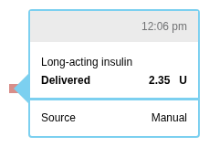
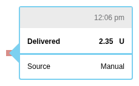

# Other Insulin Rendering

Part of the [Other Insulin Subdomain](./index.md).

---

## Injection Tooltips

Manual insulin injections display in the bolus tooltip with acting type information.

### Component

**File**: `src/components/daily/bolustooltip/BolusTooltip.js`

The BolusTooltip handles both pump boluses and manual injections, detecting the type and rendering appropriately.

### Detection Logic

```javascript
// Check if datum is manual injection
if (datum.type === 'insulin') {
  // Render injection tooltip
} else {
  // Render pump bolus tooltip
}
```

---

## Screenshots by Acting Type

| Acting Type | Screenshot | Typical Use |
|-------------|------------|-------------|
| Rapid |  | Mealtime insulin |
| Short |  | Regular insulin |
| Intermediate |  | NPH insulin |
| Long |  | Background insulin |

### Generic Injection

When acting type is not specified:



---

## Tooltip Content

Injection tooltips display:

1. **Title**: Time of injection ("h:mm a")
2. **Value**: Dose in units
3. **Type**: Acting type label (Rapid, Short, etc.)
4. **Name**: Brand name if provided

### Layout

```
┌─────────────────────────────┐
│ 12:30 PM                    │
├─────────────────────────────┤
│ Injection: 10 U             │
│ Type: Rapid                 │
│ Name: Humalog               │
└─────────────────────────────┘
```

---

## Visual Representation

### Daily View

In the Daily view, manual injections appear as:
- **Shape**: Syringe icon or distinct bolus shape
- **Position**: At injection time on timeline
- **Color**: Purple (same as bolus)

### Differentiation from Pump Boluses

| Aspect | Pump Bolus | Manual Injection |
|--------|------------|------------------|
| Data type | `bolus` | `insulin` |
| Tooltip header | "Bolus" | "Injection" |
| Extended delivery | Possible | N/A |
| Wizard info | May include | Never includes |
| Acting type | Implicit (rapid) | Explicit (varies) |

---

## Key Source Files

| Purpose | File |
|---------|------|
| Bolus/Injection Tooltip | `src/components/daily/bolustooltip/BolusTooltip.js` |
| Acting type utilities | `src/utils/bolus.js` |
| Insulin formatting | `src/utils/format.js` |

---

## See Also

- [Other Insulin Overview](./index.md) - Data structure and acting types
- [Insulin Domain](../index.md) - Parent domain
- [Bolus Rendering](../bolus/rendering.md) - Pump bolus comparison
