# Component Reference

Visual catalog of the rendering components provided by @tidepool/viz. Screenshots are generated from Storybook and represent the various states each component can render.

---

## Data Renderers

SVG components for rendering diabetes device data on timelines (Daily view, PDF reports).

**Source**: `src/components/common/data/`

### Basal

Renders basal insulin rate sequences showing scheduled, temp, and automated delivery patterns.

| Scheduled Basals | Automated Basals |
|------------------|------------------|
|  |  |

| Scheduled Flat Rate | Automated with Suspend |
|---------------------|------------------------|
|  |  |

| Automated and Scheduled | Flat Rate with Discontinuities |
|-------------------------|-------------------------------|
|  |  |

#### Temp Basals

| Simple Positive Temp | Simple Negative Temp |
|----------------------|----------------------|
|  |  |

| Positive Across Boundary | Negative Across Boundary |
|--------------------------|--------------------------|
|  |  |

#### Suspend Basals

| Simple Suspend | Suspend Across Boundary |
|----------------|-------------------------|
|  |  |

---

### Bolus

Renders insulin bolus events with optional carb circles. Supports normal, extended (square), and combo boluses with various override/underride and interruption states.

#### Basic Bolus Types

| Normal | Extended (Square) | Combo |
|--------|-------------------|-------|
|  | %20bolus.png) |  |

#### Interrupted Boluses

| Interrupted Normal | Interrupted Extended | Interrupted Combo (Extended) |
|--------------------|----------------------|------------------------------|
|  | %20bolus.png) | .png) |

| Interrupted Combo (Immediate) |
|-------------------------------|
| .png) |

#### Overrides (Delivered More Than Recommended)

| Normal Override | Extended Override | Combo Override |
|-----------------|-------------------|----------------|
|  | %20bolus.png) |  |

| Zero Override | Override + Interrupt |
|---------------|----------------------|
|  |  |

| Combo Override Interrupted |
|----------------------------|
|  |

#### Underrides (Delivered Less Than Recommended)

| Normal Underride | Extended Underride | Combo Underride |
|------------------|--------------------| ----------------|
|  | %20bolus.png) |  |

| Underride + Interrupt | Extended Underride Interrupted | Zero Underride (Not Rendered) |
|-----------------------|--------------------------------|-------------------------------|
|  |  |  |

---

### Suspend

Renders pump suspend periods on the basal timeline.

| Single Automated Suspend | Multiple Automated Suspends |
|--------------------------|----------------------------|
|  |  |

---

## Statistics

Flexible components for displaying calculated diabetes statistics.

**Source**: `src/components/common/stat/`

### Stat

The primary statistic display component with bar charts, legends, hover states, and collapsible details.

#### Glucose Statistics

| Time In Range | Readings In Range |
|---------------|-------------------|
|  |  |

| Average Glucose | Standard Deviation |
|-----------------|-------------------|
|  |  |

| Coefficient of Variation | Glucose Management Indicator |
|--------------------------|------------------------------|
|  |  |

#### Insulin & Device Statistics

| Avg. Daily Insulin | Total Insulin |
|--------------------|---------------|
|  |  |

| Time In Auto | Time In Override |
|--------------|------------------|
|  |  |

| Avg. Daily Carbs | Sensor Usage |
|------------------|--------------|
|  |  |

---

## Tooltips

Interactive tooltips displayed on hover in the Daily view and other contexts.

### Bolus Tooltip

**Source**: `src/components/daily/bolustooltip/BolusTooltip.js`

#### Basic Types

| Normal | Extended | Combo |
|--------|----------|-------|
|  | 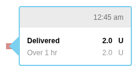 |  |

| Automated | Override | Underride |
|-----------|----------|-----------|
|  |  | 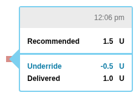 |

#### Cancelled/Interrupted

| Cancelled | Cancelled Extended | Cancelled in Combo (Normal) |
|-----------|--------------------|-----------------------------|
| 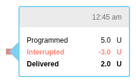 | 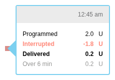 |  |

| Cancelled in Combo (Extended) | Immediately Cancelled | Immediately Cancelled Extended |
|-------------------------------|----------------------|--------------------------------|
|  |  | 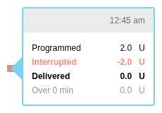 |

#### With Wizard Data

| With BG Input | With Carb Input | With BG and Carb Input |
|---------------|-----------------|------------------------|
|  |  |  |

| With BG Input and IOB | With Net Recommendation | With Carb Exchange |
|-----------------------|-------------------------|-------------------|
|  |  | 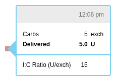 |

#### Manufacturer-Specific Targets

| Tandem Target | Medtronic Target | Insulet Target |
|---------------|------------------|----------------|
|  | 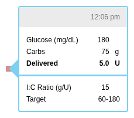 |  |

| Animas Target | Auto Target | Loop Dosing Decision |
|---------------|-------------|----------------------|
|  |  |  |

#### Extended/Animas Specific

| Extended Animas | Extended Animas Underride | Combo Override |
|-----------------|---------------------------|----------------|
|  | 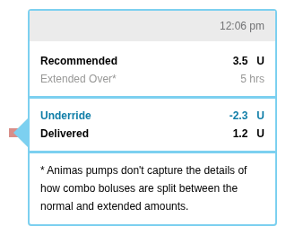 |  |

| Combo Underride Cancelled | Combo Underride Cancelled with BG |
|---------------------------|-----------------------------------|
|  |  |

#### Precision Variants

| Normal Precise | Normal Very Precise |
|----------------|---------------------|
|  |  |

#### Pen/Injection Insulin Types

| Insulin (Pen) | Rapid | Short |
|---------------|-------|-------|
|  |  |  |

| Intermediate | Long |
|--------------|------|
|  |  |

---

### CBG Tooltip (Continuous Glucose)

**Source**: `src/components/daily/cbgtooltip/CBGTooltip.js`

| Very Low | Low | Target |
|----------|-----|--------|
|  |  | 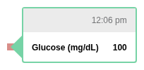 |

| High | Very High |
|------|-----------|
|  | 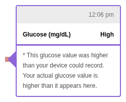 |

---

### SMBG Tooltip (Fingerstick)

**Source**: `src/components/daily/smbgtooltip/SMBGTooltip.js`

#### Basic Readings

| Very Low | Low | Target |
|----------|-----|--------|
|  | 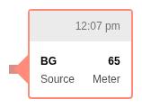 |  |

| High | Very High |
|------|-----------|
| 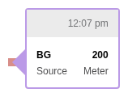 |  |

#### Entry Types

| Manual | Linked (to meter) |
|--------|-------------------|
|  |  |

#### Medtronic 600-Series Specific

| Accepted | Accepted Manual | Calibration Manual |
|----------|-----------------|-------------------|
|  |  |  |

| Non-Calibration Manual | Accepted Non-Calib Manual | Rejected |
|------------------------|---------------------------|----------|
|  |  |  |

| Rejected Linked | Timed Out | Timeout Manual |
|-----------------|-----------|----------------|
|  |  |  |

---

### Alarm Tooltip

**Source**: `src/components/daily/alarmtooltip/AlarmTooltip.js`

| Auto Off | No Delivery | No Insulin |
|----------|-------------|------------|
|  |  |  |

| No Power | Occlusion | Over Limit |
|----------|-----------|------------|
|  |  |  |

---

### Event Tooltip

**Source**: `src/components/daily/eventtooltip/EventTooltip.js`

| Notes | Pump Shutdown |
|-------|---------------|
|  |  |

#### Health Events

| Stress | Other (with Notes) |
|--------|-------------------|
| .png) | .png) |

#### Physical Activity

| Low | Medium | High |
|-----|--------|------|
| .png) | .png) | .png) |

---

### Food Tooltip

**Source**: `src/components/daily/foodtooltip/FoodTooltip.js`

| Standard | Dexcom | Loop |
|----------|--------|------|
|  |  |  |

| Loop Edited | Loop Time of Entry |
|-------------|-------------------|
|  |  |

---

### Pump Settings Override Tooltip

**Source**: `src/components/daily/pumpsettingsoverridetooltip/PumpSettingsOverrideTooltip.js`

| Sleep | Exercise | Pre-Meal |
|-------|----------|----------|
|  |  |  |

---

### Stat Tooltip

**Source**: `src/components/common/tooltips/StatTooltip.js`

Displays annotations and additional context for statistics.

| Short Annotation | Long Annotation |
|------------------|-----------------|
|  |  |

| Multiple Annotations | Markdown Annotation |
|----------------------|---------------------|
|  |  |

---

### Other Tooltips

#### CGM Sample Interval Tooltip

**Source**: `src/components/common/tooltips/CgmSampleIntervalTooltip.js`

#### Events Info Tooltip

**Source**: `src/components/common/tooltips/EventsInfoTooltip.js`

---

## Device Settings

Tabular display of insulin pump settings by manufacturer.

**Source**: `src/components/settings/`

### Tandem

| Flat Rate | Multi Rate |
|-----------|------------|
|  |  |

### Medtronic

| Flat Rate | Multi Rate | Automated |
|-----------|------------|-----------|
|  |  |  |

### OmniPod

| Flat Rate | Multi Rate |
|-----------|------------|
|  |  |

### Loop

| Flat Rate | Multi Rate |
|-----------|------------|
|  |  |

### Animas

| Flat Rate | Multi Rate |
|-----------|------------|
|  |  |

---

## PDF Reports

PrintView classes for generating PDF reports. These are **not** React components - they use pdfkit directly and run in a Web Worker.

**Source**: `src/modules/print/`

### Combined Views

| AGP (CGM) | AGP (BGM) |
|-----------|-----------|
|  |  |

| Basics | Daily |
|--------|-------|
|  |  |

| BG Log | Settings |
|--------|----------|
|  |  |

### Prescription

