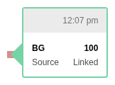

# Daily View

The Daily view provides a detailed 24-hour timeline of diabetes data, showing glucose readings, insulin delivery, carbohydrates, and device events. It's the most detailed view in the Tidepool platform.

---

## Overview


The Daily view displays:
- **Glucose readings** (CGM line + BGM dots)
- **Bolus insulin** (vertical bars)
- **Basal insulin** (filled area chart)
- **Carbohydrate entries** (circles)
- **Device events** (icons for alarms, exercise, notes, health events)
- **Settings overrides** (markers for sleep/exercise modes)

Each day is rendered as a horizontal timeline spanning midnight to midnight.

---

## Layout Structure

The Daily view divides vertical space into distinct zones:

```
┌──────────────────────────────────────────────────┐
│  Events/Notes zone (alarms, health, exercise)    │
├──────────────────────────────────────────────────┤
│                                                  │
│  Glucose + Bolus zone (BG chart + insulin bars)  │
│                                                  │
├──────────────────────────────────────────────────┤
│  Bolus details (insulin amounts, carbs)          │
├──────────────────────────────────────────────────┤
│  Basal zone (rate chart + override markers)      │
└──────────────────────────────────────────────────┘
```

### Zone Proportions

From `DailyPrintView.calculateChartMinimums()`:

| Zone | Proportion | Purpose |
|------|------------|---------|
| `notesEtc` | 3/20 | Events, alarms, notes icons |
| `bgEtcChart` | 9/20 | Glucose readings + bolus bars |
| `bolusDetails` | 4/20 | Insulin amounts, carb labels |
| `basalChart` | 3/20 | Basal rate area chart |
| `belowBasal` | 1/20 | Override markers |

---

## Data Layers

### CGM Data (Continuous Glucose)

CGM readings render as small dots connected by lines:

```javascript
// Rendering constants
this.cbgRadius = 1;  // small dot size
```

Colors are determined by glucose range:
- **Very Low** (< 54 mg/dL): Red
- **Low** (54-69 mg/dL): Red
- **Target** (70-180 mg/dL): Green
- **High** (181-249 mg/dL): Yellow/Orange
- **Very High** (≥ 250 mg/dL): Red/Orange

### SMBG Data (Fingersticks)

SMBG readings render as larger circles:

```javascript
this.smbgRadius = 3;  // larger than CGM
```

#### SMBG Tooltip Variations

| Scenario | Screenshot |
|----------|------------|
| Target range |  |
| High reading |  |
| Low reading |  |
| Manual entry |  |
| Linked to bolus |  |

### Bolus Insulin

Boluses render as vertical bars with optional override triangles:

```javascript
this.bolusWidth = 3;
this.triangleHeight = 1.25;  // for override indicators
```

#### Bolus Types

| Type | Visual | Screenshot |
|------|--------|------------|
| Normal | Solid bar |  |
| Extended | Bar with horizontal line | %20bolus.png) |
| Combo | Both portions shown | See bolus domain docs |
| Override (up) | Triangle pointing up |  |
| Underride (down) | Triangle pointing down |  |
| Interrupted | Dashed portion |  |

#### Bolus Tooltip Examples


### Basal Insulin

Basal rates render as a filled area chart at the bottom:

```javascript
// Color coding by delivery type
this.colors.basal = {
  automated: colors.basalAutomated,
  manual: colors.basalManual,
};
```

Automated (closed-loop) vs manual delivery are shown in different colors.

### Carbohydrates

Carbs render as circles above bolus bars:

```javascript
this.carbRadius = 4.25;
```

The carb amount (grams) appears as text below the circle when space permits.

#### Food Tooltip


### Device Events

Events render as icons in the notes zone:

```javascript
const eventImages = {
  [ALARM]: 'images/alarm.png',
  [EVENT_HEALTH]: 'images/event-health.png',
  [EVENT_PHYSICAL_ACTIVITY]: 'images/event-physical_activity.png',
  [EVENT_NOTES]: 'images/event-notes.png',
};
```

#### Event Tooltip Examples

| Event Type | Screenshot |
|------------|------------|
| Exercise (high intensity) | .png) |
| Exercise (medium) | .png) |
| Health event | .png) |
| Notes |  |
| Pump shutdown |  |

### Settings Overrides

Override modes (sleep, exercise) show as markers below the basal chart:

```javascript
this.pumpSettingsOverrideLabels = {
  [SLEEP]: deviceLabels[SLEEP],
  [PHYSICAL_ACTIVITY]: deviceLabels[PHYSICAL_ACTIVITY],
  [PREPRANDIAL]: deviceLabels[PREPRANDIAL],
};
```

Markers use single-character labels: **Z** (sleep), **E** (exercise), **P** (pre-meal).


---

## Legend

The Daily view includes a dynamic legend showing only relevant items:

```javascript
getLegendItems() {
  const legendItems = [
    { type: 'cbg', show: hasCGM, labels: ['CGM'] },
    { type: 'smbg', show: hasSMBG, labels: ['BGM'] },
    { type: 'bolus', show: hasBolus, labels: ['Bolus', 'manual &', 'automated'] },
    { type: 'override', show: hasOverrides, labels: ['Override', 'up & down'] },
    { type: 'interrupted', show: hasInterrupted, labels: ['Interrupted'] },
    { type: 'extended', show: hasExtended, labels: ['Combo /', 'Extended'] },
    { type: 'insulin', show: hasOtherInsulin, labels: ['Insulin, other'] },
    { type: 'basals', show: hasBasal, labels: ['Basals', 'automated &', 'manual'] },
    { type: 'carbs', show: hasCarbs, labels: ['Carbs (g)'] },
    { type: 'physical_activity', show: hasExercise, labels: ['Exercise', 'event'] },
    { type: 'health', show: hasHealth, labels: ['Health', 'event'] },
    { type: 'notes', show: hasNotes, labels: ['Note'] },
    { type: 'alarms', show: hasAlarms, labels: ['Pump', 'Alarm'] },
  ];
  return _.filter(legendItems, 'show');
}
```

---

## Tooltip Components

Each data type has a dedicated tooltip component in `src/components/daily/`:

| Data Type | Component | CSS |
|-----------|-----------|-----|
| Alarms | `AlarmTooltip.js` | `AlarmTooltip.css` |
| Bolus | `BolusTooltip.js` | `BolusTooltip.css` |
| CGM | `CBGTooltip.js` | `CBGTooltip.css` |
| Events | `EventTooltip.js` | `StandardEventTooltip.css` |
| Food | `FoodTooltip.js` | `FoodTooltip.css` |
| Overrides | `PumpSettingsOverrideTooltip.js` | `PumpSettingsOverrideTooltip.css` |
| SMBG | `SMBGTooltip.js` | `SMBGTooltip.css` |

---

## Scales

The Daily view uses D3 linear scales for positioning:

```javascript
makeScales(dateChart) {
  // BG scale: 0 to clampThreshold (typically 400 mg/dL)
  dateChart.bgScale = scaleLinear()
    .domain([0, this.bgScaleYLimit])
    .range([bgChartBottom, bgChartTop])
    .clamp(true);  // clamp values above threshold
    
  // Bolus scale: 0 to max bolus
  dateChart.bolusScale = scaleLinear()
    .domain([0, this.bolusRange[1] || 1])
    .range([bgChartBottom, bgChartTop + 1/3]);
    
  // Basal scale: 0 to max basal rate
  dateChart.basalScale = scaleLinear()
    .domain([0, this.basalRange[1]])
    .range([basalBottom, basalTop]);
}
```

---

## Pagination

For PDF output, the Daily view calculates charts per page:

```javascript
this.chartsPerPage = opts.chartsPerPage;  // typically 3
this.numDays = this.endpoints.activeDays;
```

Each day's chart height adapts based on bolus density:

```javascript
calculateDateChartHeight({ data, date }) {
  // Group boluses into 3-hour bins
  const threeHrBinnedBoluses = _.groupBy(data.bolus, d => bolus.threeHrBin);
  
  // Find maximum stack height
  const maxBolusStack = _.max(_.map(bins, countBolusLines));
  
  // Adjust chart height accordingly
  this.chartsByDate[date].chartHeight = _.max([
    minimumHeight,
    calculatedHeight
  ]);
}
```

---

## Key Source Files

| Purpose | File |
|---------|------|
| PDF rendering | `src/modules/print/DailyPrintView.js` |
| Tooltip components | `src/components/daily/*.js` |
| Basal path rendering | `src/modules/render/basal.js` |
| Bolus path rendering | `src/modules/render/bolus.js` |
| Print data processing | `src/utils/print/data.js` |
| Stories (examples) | `stories/components/daily/*.js` |
| Tests | `test/components/daily/*.test.js` |

---

## See Also

- [Bolus Domain](../domains/bolus/index.md) - Bolus rendering details
- [Basal Domain](../domains/basal/index.md) - Basal visualization
- [Device Events](../domains/device-events/index.md) - Event icons and tooltips
- [Glucose Domain](../domains/glucose/index.md) - CGM/SMBG rendering
- [PDF Reports](./pdf-reports.md) - Multi-page PDF output
