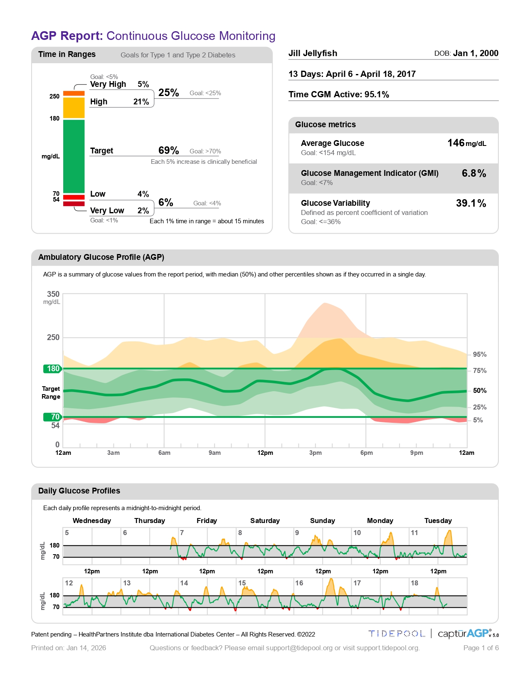
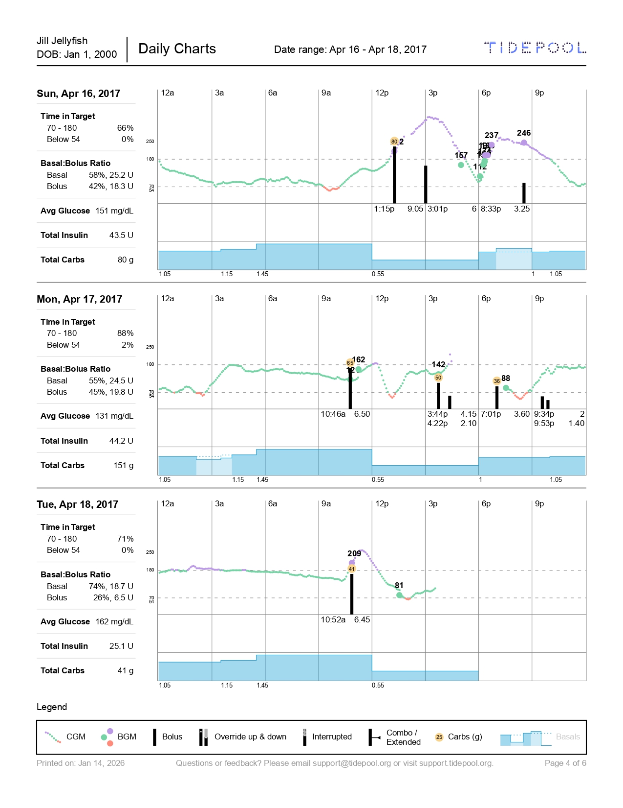

# PDF Reports

The PDF reports module generates printable documents from diabetes data. Reports can be generated individually or as a combined package containing multiple views.

---

## Overview

The viz library supports generating these PDF report types:

| Report Type | Class | Description |
|-------------|-------|-------------|
| `agpCGM` | `AGPPrintView` | Ambulatory Glucose Profile (CGM) |
| `agpBGM` | `AGPPrintView` | Ambulatory Glucose Profile (BGM) |
| `basics` | `BasicsPrintView` | 2-week summary with calendars |
| `daily` | `DailyPrintView` | Day-by-day timeline charts |
| `bgLog` | `BgLogPrintView` | Blood glucose log table |
| `settings` | `SettingsPrintView` | Pump settings snapshot |
| `prescription` | `PrescriptionPrintView` | Loop therapy settings order |

---

## Combined PDF Package

The most common use case is generating a combined PDF with all relevant views:

```javascript
import { createPrintPDFPackage } from '@tidepool/viz';

const pdf = await createPrintPDFPackage(data, {
  patient,
  pdfType: 'combined',
  agpCGM: { disabled: false },
  agpBGM: { disabled: true },   // disable if no BGM data
  basics: { disabled: false },
  daily: { disabled: false },
  bgLog: { disabled: false },
  settings: { disabled: false },
});

// pdf.blob - Blob object for download
// pdf.url - Object URL for preview
```

### Render Order (Combined)

When `pdfType: 'combined'`:

1. AGP CGM (if enabled)
2. AGP BGM (if enabled)
3. Basics
4. Daily
5. BG Log
6. Settings

If all sections are disabled, a "No Data" page is rendered.

---

## Individual Reports

Generate a single report type:

```javascript
const pdf = await createPrintPDFPackage(data, {
  patient,
  pdfType: 'daily',  // or 'basics', 'bgLog', 'settings', etc.
});
```

---

## PDF Architecture

### Base Class: PrintView

All print views inherit from `PrintView`, which provides:

```javascript
class PrintView {
  constructor(doc, data, opts) {
    this.doc = doc;                    // PDFKit document
    this.bgPrefs = data.bgPrefs;       // glucose thresholds
    this.timePrefs = data.timePrefs;   // timezone settings
    this.endpoints = data.endpoints;    // date range
    this.stats = {};                   // calculated statistics
    this.aggregationsByDate = {};      // daily aggregations
  }
  
  // Common rendering methods
  renderSimpleStat(stat) { ... }
  renderHorizontalBarStat(stat, opts) { ... }
  renderTable(data, columns) { ... }
  getDateRange(start, end) { ... }
  newPage(title) { ... }
}
```

### PDF Constants

From `src/modules/print/utils/constants.js`:

```javascript
export const DPI = 72;
export const MARGIN = 36;              // 0.5 inch
export const WIDTH = 612;              // Letter width (8.5")
export const HEIGHT = 792;             // Letter height (11")

export const MARGINS = {
  top: 36,
  bottom: 36,
  left: 36,
  right: 36,
};

// Font sizes
export const DEFAULT_FONT_SIZE = 10;
export const SMALL_FONT_SIZE = 8;
export const FOOTER_FONT_SIZE = 8;
export const HEADER_FONT_SIZE = 14;
```

---

## Report Types

### AGP (Ambulatory Glucose Profile)

Standardized glucose reporting format showing:

- **Glucose Metrics**: Average glucose, GMI, CV, sensor time
- **Percent in Ranges**: Time in Range bar chart
- **Ambulatory Glucose Profile**: Percentile bands by time of day
- **Daily Glucose Profiles**: Individual day traces




The AGP view uses external SVG data URLs for chart rendering:

```javascript
renderOpts = {
  svgDataURLS: svgDataURLS?.agpCGM,  // Pre-rendered SVG charts
};
```

### Basics

Two-week summary with:

- Statistics column (TIR, average glucose, etc.)
- Calendar grids (BG readings, boluses, site changes, basals)
- Summary tables


See [Basics View](./basics.md) for details.

### Daily

Day-by-day timeline showing:

- CGM/SMBG glucose
- Bolus insulin
- Basal rates
- Carbohydrates
- Device events



See [Daily View](./daily.md) for details.

### BG Log

Tabular blood glucose readings:


### Settings

Pump configuration snapshot:

- Basal schedules
- Carb ratios
- Sensitivity factors
- BG targets


---

## Creating Custom Reports

### Using createPrintView

The `createPrintView` factory function instantiates the appropriate renderer:

```javascript
import { createPrintView } from '@tidepool/viz';

const doc = new PDFDocument({ autoFirstPage: false, bufferPages: true });
const renderer = createPrintView('daily', data, {
  patient,
  chartsPerPage: 3,
  title: 'Daily Charts',
}, doc);

await renderer.render();
doc.end();
```

### Render Options

| Option | Type | Description |
|--------|------|-------------|
| `patient` | Object | Tidepool patient object |
| `dpi` | Number | Dots per inch (default: 72) |
| `margins` | Object | Page margins `{top, bottom, left, right}` |
| `debug` | Boolean | Enable debug rendering |
| `svgDataURLS` | Object | Pre-rendered SVG URLs for AGP |
| `chartsPerPage` | Number | Charts per page (Daily view) |

---

## Static Assets

Print views use static images registered at build time:

```javascript
// src/modules/print/registerStaticFiles.js
// Images are base64-encoded and registered with PDFKit

const images = {
  'images/sitechange-cannula.png': base64Data,
  'images/sitechange-reservoir.png': base64Data,
  'images/alarm.png': base64Data,
  'images/tidepool-logo-408x46.png': base64Data,
  // ... etc
};
```

---

## Page Layout

### Multi-Column Layout

Views can use column layouts:

```javascript
this.setLayoutColumns({
  width: this.chartArea.width,
  gutter: 14,
  type: 'percentage',
  widths: [25.5, 49, 25.5],  // 3 columns
});

// Navigate between columns
this.goToLayoutColumnPosition(0);  // left column
this.goToLayoutColumnPosition(1);  // center column
```

### Page Navigation

```javascript
// Add new page
this.newPage('Page Title');

// Navigate to specific page
this.goToPage(0);

// Page numbers rendered at end
PrintView.renderPageNumbers(doc);
```

---

## Key Source Files

| Purpose | File |
|---------|------|
| Entry point | `src/modules/print/index.js` |
| Base class | `src/modules/print/PrintView.js` |
| AGP view | `src/modules/print/AGPPrintView.js` |
| Basics view | `src/modules/print/BasicsPrintView.js` |
| Daily view | `src/modules/print/DailyPrintView.js` |
| BG Log view | `src/modules/print/BgLogPrintView.js` |
| Settings view | `src/modules/print/SettingsPrintView.js` |
| Constants | `src/modules/print/utils/constants.js` |
| AGP utilities | `src/modules/print/utils/AGPUtils.js` |
| Static files | `src/modules/print/registerStaticFiles.js` |
| Stories | `stories/print/*.js` |
| Tests | `test/modules/print/*.test.js` |

---

## Dependencies

- **PDFKit**: Core PDF generation library
- **voilab-pdf-table**: Table rendering plugin
- **svg-to-pdfkit**: SVG embedding support

---

## See Also

- [Daily View](./daily.md) - Daily chart rendering details
- [Basics View](./basics.md) - Basics calendar layout
- [Trends View](./Trends.md) - Interactive web version
